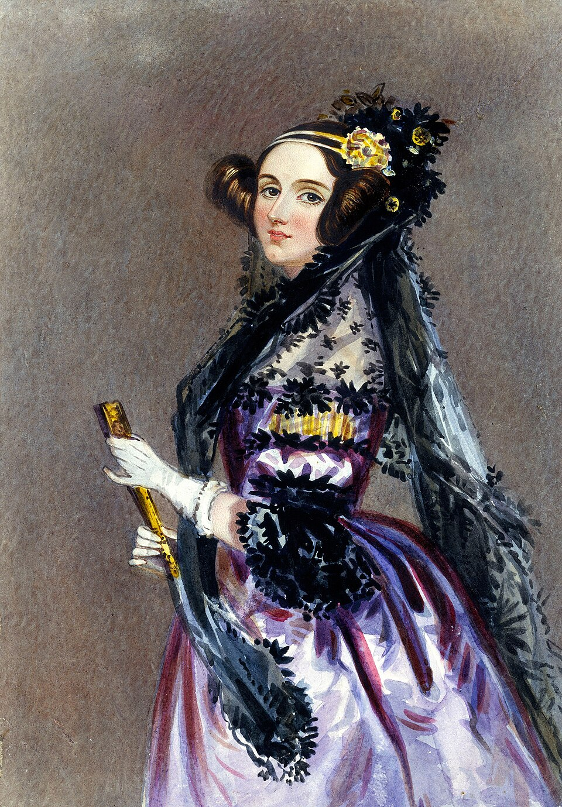

# Ada Lovelace

<figure>

<figcaption>Além de ter escrito o primeito algoritmo de programação, ela também é a diva do squad Ada Lovelace!</figcaption>
</figure>

## Quem foi Ada Lovelace?
Augusta Ada Byron King, Condessa de Lovelace (nascida Byron, 10 de dezembro de 1815 — 27 de novembro de 1852), atualmente conhecida como Ada Lovelace, foi uma matemática e escritora inglesa. Hoje é reconhecida principalmente por ter escrito o primeiro algoritmo para ser processado por uma máquina, a máquina analítica de Charles Babbage. Durante o período em que esteve envolvida com o projeto de Babbage, ela desenvolveu os algoritmos que permitiriam à máquina computar os valores de funções matemáticas, além de publicar uma coleção de notas sobre a máquina analítica. Por esse trabalho é considerada a primeira programadora de toda a história.

## Principais conquistas
Em 1842, Charles Babbage foi convidado a ministrar um seminário na Universidade de Turim sobre sua máquina analítica. Luigi Menabrea, um jovem engenheiro italiano e futuro Primeiro-ministro da Itália, publicou a palestra de Babbage em francês e esta transcrição foi posteriormente publicada na Bibliothèque Universelle de Genève, em 1842.

Babbage pediu a Lovelace para traduzir o artigo de Menabrea para o inglês, adicionando depois a tradução com as anotações que ela mesma havia feito. Lovelace levou grande parte do ano nesta tarefa. Estas notas, que são mais extensas que o artigo de Menabrea, foram então publicados no The Ladies' Diary e no Memorial Científico de Taylor sob as iniciais "AAL".

Em 1953, mais de cem anos depois de sua morte, as notas de Lovelace sobre a máquina analítica de Babbage foram republicadas. A máquina foi reconhecida como um primeiro modelo de computador e as notas de Lovelace como a descrição de um computador e um software.

As notas de Lovelace foram classificadas alfabeticamente de A a G. Na nota G ela descreve o algoritmo para a máquina analítica computar a Sequência de Bernoulli. É considerado o primeiro algoritmo especificamente criado para ser implementado num computador, e Lovelace é recorrentemente citada como a primeira pessoa programadora por esta razão. No entanto, a máquina analítica de Babbage jamais foi construída, tendo apenas a sua precursora a máquina diferencial sido montada em um trabalho que começou em 1984 por Allan G. Bromley professor da Universidade de Sydney junto com Doron Swade (The London Sience Museum), onde esses levaram 18 anos para finaliza-la.

Fonte: [Wikipedia](https://pt.wikipedia.org/wiki/Ada_Lovelace)

### Para conhecer mais
[Ada Lovelace (Wikipedia)](https://pt.wikipedia.org/wiki/Ada_Lovelace)

# O que aprendi com Git e GitHub
Git e GitHub são, respectivamente, uma ferramenta de versionamento e uma plataforma de armazenamento de repositório, ambos essenciais para o cenário atual de tecnologia, possibilitando melhor colaboração em projetos totalmente auditáveis. Esse repositório foi criado para falar um pouquinho sobre o que aprendi sobre elas durante o bootcamp da WoMakersCode.

A seguir, vou falar um pouco sobre alguns comandos que utilizei no GitBash para versionar esse repositório:

1. Comandos de navegação:

| cd    | muda o diretório                                 |
|-------|--------------------------------------------------|
| cd .. | muda para o diretório-mãe acima do caminho atual |
| cd -  | muda para o diretório anterior                   |
| pwd   | printa o diretório atual                         |

2. Comandos de manipulação de arquivo

| prompt | o que faz | exemplo
|-----------------------------------|------------------------------------------------------------------------------------------| ---------------------------------------------------------|
| cp (pode ser *copy* em alguns OS) | copia o arquivo indicado                                                                 | Ex.: cp nome-do-arquivo.txt C:/caminho/para/onde/copiar |
| rm                                | remove o arquivo indicado                                                                | Ex.: rm nome-do-arquivo.txt                             |
| rm -rf                            | remove forçadamente arquivos e diretórios. Ou seja, não pede pede permissão para apagar. | Ex: rm -rf teste (apaga o diretório "/teste")           |
| touch                             | cria arquivo no diretório atual                                                          | Ex.: touch README.md                                    |
| echo                              | modifica arquivo                                                                         | Ex.: echo "Olá, mundo" > README.md                      |
| cat                               | exibe o conteúdo do arquivo                                                              | Ex.: cat README.md                                      |

3. Comandos de versionamento repositório Git

| prompt                   | o que faz                                                      |
|--------------------------|----------------------------------------------------------------|
| git init                 | cria um arquivo oculto que inicializa o repositório localmente |
| git add                  | adiciona arquivos para stage                                   |
| git remote add origin    | adiciona arquivos no stage remoto                              |
| git commit -m "mensagem" | comita os arquivos para a branch remota                        |
| git push -u main         | transforma a branch em main                                    |